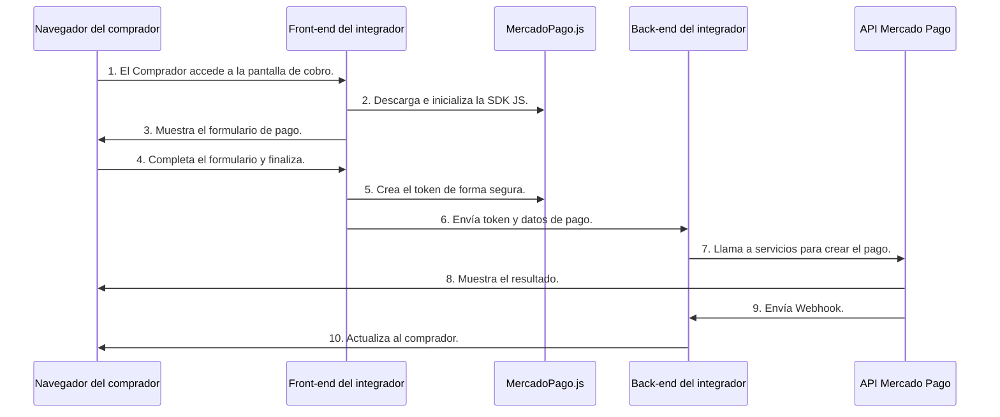

# Modelo de integración

Checkout API ahora procesa pagos con **Orders**. Se trata de una API diseñada para simplificar tu desarrollo con Mercado Pago: con una única integración, podrás acceder a diversas soluciones de pago.

Además, la API hace que el código de integración sea más intuitivo y proporciona mensajes de error más detallados, facilitando el proceso de desarrollo.

## Diferencias en el procesamiento

Anteriormente, los pagos a través de Checkout API eran procesados exclusivamente por la **API de Pagos**. Ahora, también es posible procesarlos mediante Orders, que ofrece una alternativa eficiente y sencilla para la integración.

Ve a continuación las principales diferencias entre las dos opciones.

| Funcionalidad | API de Pagos | API de Orders |
| --- | --- | --- |
| Procesamiento del pago | Automático (crea y procesa tu transacción). | Automático y manual (eligiendo cuándo procesar la transacción). |
| Transacciones | Una transacción por solicitud. | Múltiples transacciones por solicitud. |
| Operaciones | Pagos online. | Pagos online y Pagos presenciales (Point de Mercado Pago y Código QR). |
| Notificaciones | Configuración avanzada por `notification_url`. | Configuración más simple a partir de la sección de Notificaciones en Tus integraciones. |
| Validación de errores | Retorna un error a la vez. | Retorna una lista con todos los errores en la solicitud. |

## Modos de procesamiento de Orders

Una order de pagos online puede ser creada para ser procesada de dos modos: **Modo automático** y **Modo manual**. La definición del modo de procesamiento se realizará al momento de crear la order, mediante el parámetro `processing_mode`. Su valor deberá ser `automatic`, para procesamientos automáticos, o `manual`, para procesar la order manualmente.

### Modo automático

El **modo automático** es el modo predeterminado de la aplicación. A través de este, la transacción se completa en una sola etapa y las modificaciones son limitadas. Para crear la order en modo automático, el campo `processing_mode`, que es responsable de definir el formato de creación y procesamiento de la transacción, debe estar como `automatic` y toda la información es enviada en una única solicitud.

Las operaciones permitidas son:

* **Crear y procesar order**: responsable por la creación de la order y el procesamiento de la transacción en simultáneo.
* **Obtener order**: permite obtener información sobre una order, incluido su status en tiempo real.
* **Buscar order**: permite buscar orders de forma masiva, utilizando diversos filtros e información de paginación.
* **Capturar order**: permite capturar el monto autorizado de una order. Esta opción solo es válida para tarjetas de crédito.
* **Cancelar order**: responsable de la cancelación de una order ya existente, pero que aún no ha sido procesada.
* **Reembolsar order**: permite el reembolso total o parcial de un pago. La order será reembolsada totalmente si todas las transacciones son reembolsadas por completo.
* **Reembolso total**: no se debe indicar un monto a reembolsar en el `body` de la solicitud, que debe ir vacío.
* **Reembolso parcial**: se debe especificar la cantidad a reembolsar en el `body` de la solicitud, junto con el ID de la transacción. Todas las otras transacciones permanecerán como están y solo la transacción modificada será reembolsada.


### Modo manual

El **modo manual** permite dividir el procesamiento de la transacción en etapas que pueden ser configuradas y ejecutadas de manera incremental. Permite la personalización de cada etapa del proceso de pago, adaptándose a diferentes necesidades y escenarios. Para crear la order en modo manual, es necesario asegurarse de que el campo `processing_mode`, responsable de definir el formato de creación y procesamiento de la transacción, esté como `manual`.

Las operaciones permitidas son:

* **Crear order (con o sin transacciones)**: responsable por la creación y autorización de la order, pero sin procesamiento en simultáneo.
* **Agregar transacción**: esta operación de adición de transacciones solo puede realizarse en modo manual y es responsable de agregar más de una transacción en un mismo *payload*.
* **Modificar transacción y/o eliminar transacción**: la modificación y eliminación de transacciones solo pueden realizarse en modo manual, y permiten cambiar la información de pago que ya se había agregado anteriormente a una order. Es una operación que modifica un elemento dentro de cualquier campo del parámetro `transactions`.
* **Capturar order**: responsable por capturar el monto autorizado de una order. Esta opción solo es válida para tarjetas de crédito.
* **Procesar transacción**: permite ejecutar las transacciones creadas y/o modificadas en modo manual.
* **Obtener order**: permite obtener información sobre una order, incluido su status en tiempo real.
* **Buscar order**: permite buscar orders de forma masiva, utilizando diversos filtros e información de paginación.
* **Cancelar order**: responsable por la cancelación de una order ya existente, pero que aún no ha sido procesada/terminada.
* **Reembolsar order o transacción**: en modo manual se puede crear reembolsos totales o parciales de un pago. La order será reembolsada totalmente si todas las transacciones son reembolsadas por completo.
* **Reembolso total**: no se debe indicar un monto a reembolsar en el `body` de la solicitud, que irá vacío.
* **Reembolso parcial**: se debe especificar la cantidad a reembolsar en el `body` de la solicitud, junto con el ID de la transacción. Todas las otras transacciones permanecerán como están y solo la transacción modificada será reembolsada.


---

# Crear aplicación

[Empezar a integrar](https://www.google.com/search?q=/developers/es/docs/checkout-api-orders/create-application)

Las **aplicaciones** son entidades registradas dentro de Mercado Pago que actúan como un identificador único para gestionar la autenticación y autorización de tus integraciones. Es decir, son el vínculo entre tu desarrollo y Mercado Pago, y constituyen la primera etapa para realizar la integración.

Con ellas, es posible acceder a las **credenciales** (*Claves de acceso únicas con las que identificamos una integración en tu cuenta, vinculadas a tu aplicación*) necesarias para interactuar con nuestras APIs o servicios específicos, así como gestionar y organizar tu integración, por lo que deberás crear una aplicación por cada solución de Mercado Pago que integres.

Para crear una **aplicación**, sigue los pasos a continuación:

1. En la esquina superior derecha de Mercado Pago Developers, haz clic en **Ingresar** e ingresa los datos requeridos con la información correspondiente a tu cuenta de Mercado Pago.
2. Con la sesión iniciada, en la esquina superior derecha de Mercado Pago Developers, haz clic en **Crear aplicación** si tu cuenta aún no tiene ninguna aplicación creada, o accede a "Tus integraciones" y selecciona **Ver todas**. Allí, haz clic en **Crear aplicación**.
3. Una vez dentro de **Tus integraciones**, haz clic en el botón **Crear aplicación**.

> **NOTA:** Para proteger tu cuenta, durante la creación de una aplicación será necesario que realices una verificación de identidad, en caso de que aún no la hayas realizado, o una reautenticación, si ya has completado previamente el proceso de verificación.

4. Ingresa un **nombre** para identificar tu aplicación. El límite es de hasta 50 caracteres alfanuméricos.
5. Selecciona **Pagos online** como el tipo de pago que quieres integrar, ya que es el tipo de solución correspondiente a tiendas virtuales. Haz clic **Continuar**.
6. Selecciona que estás integrando para una tienda hecha con desarrollo propio. Opcionalmente podrás completar la URL de tu tienda. Haz clic en **Continuar**.
7. Selecciona la opción **Checkouts** y luego selecciona **Checkout API** como la solución que vas a integrar.
8. Selecciona **API de Orders** como el tipo de API con el que vas a integrar y luego seleciona **Continuar**.
9. Confirma las opciones seleccionadas. En caso de que necesites modificar alguna selección, puedes hacer clic en el botón **Editar**. Acepta la Declaración de Privacidad y los Términos y condiciones y haz clic en **Confirmar**.

En Tus integraciones podrás consultar el listado de todas tus aplicaciones creadas y acceder a los Datos de integración de cada una de ellas.

> **NOTA:** Si lo deseas, puedes editar o eliminar una aplicación. En este último caso, debes tener en cuenta que tu tienda perderá la capacidad de recibir pagos a través de la integración con Mercado Pago asociada a esa aplicación.

## Acceder a las credenciales de prueba

Después de crear tu aplicación, automáticamente también se crearán las **credenciales de prueba**. Utiliza las credenciales de prueba para realizar todas las configuraciones y validaciones necesarias en un entorno seguro de pruebas.

Al acceder a las credenciales de prueba, se mostrarán los siguientes pares de credenciales: **Public Key** (*Clave pública que es utilizada en el frontend para acceder a información y cifrar datos*) y el **Access Token** (*Clave privada de la aplicación creada en Mercado Pago, que es utilizada en el backend*).

> **NOTA:** Si estás utilizando una aplicación ya existente, será necesario activar las credenciales de prueba.

---

# Configurar ambiente de desarrollo

Para comenzar a integrar las soluciones de cobro de Mercado Pago, es necesario preparar tu ambiente de desarrollo con una serie de configuraciones básicas que te permitirán acceder a las funcionalidades de Mercado Pago desde el *frontend* de manera segura.

El entorno de desarrollo puede configurarse para integraciones en **sitios web** o **aplicaciones móviles**.

## Sitios web

**Incluir la biblioteca MercadoPago.js (Client-side)**
Utiliza nuestras bibliotecas oficiales para interactuar con Mercado Pago desde tu *frontend* y capturar los datos de los pagos realizados de forma segura.

```html
<body>
  <script src="https://sdk.mercadopago.com/js/v2"></script>
</body>

```

```node
npm install @mercadopago/sdk-js

```

**Inicializar biblioteca de Mercado Pago (Client-side)**
Para inicializar la biblioteca de Mercado Pago, deberás utilizar tus **credenciales**. Están directamente vinculadas a la aplicación que creaste para esa integración.

En esta etapa, deberás utilizar tu **Public Key de prueba**.

> **NOTA:** Si estás desarrollando para otra persona, podrás acceder a las credenciales de las aplicaciones que no administras.

Una vez hayas localizado la Public Key de prueba, cópiala e inclúyela en el *frontend* para poder acceder a los datos necesarios.

```html
<script>
  const mp = new MercadoPago("YOUR_PUBLIC_KEY");
</script>

```

```javascript
import { loadMercadoPago } from "@mercadopago/sdk-js";

await loadMercadoPago();
const mp = new window.MercadoPago("YOUR_PUBLIC_KEY");

```

## Aplicaciones móviles

Utiliza el SDK nativo de Mercado Pago y simplifica el proceso de pago con tarjeta en aplicaciones Android e iOS de manera segura.

### iOS

Utiliza el SDK nativo de Mercado Pago para integrar medios de pago en aplicaciones iOS.

**Instalar SDK**

1. En Swift Package Manager, haz clic en **Archivo > Añadir paquetes**.
2. Pega la URL del repositorio: `https://github.com/mercadopago/sdk-ios`.
3. Selecciona la versión deseada del SDK.
4. Haz clic en **Añadir paquete** para completar la instalación.

**Agregar dependencias**
Importa las dependencias del SDK en tu proyecto:

```swift
import CoreMethods

```

**Inicializar SDK**
Después de instalar el SDK y agregar las dependencias, inicializa el SDK al inicio del ciclo de vida de la aplicación.

> **ADVERTENCIA:** El SDK debe inicializarse una sola vez al abrir la aplicación realizando una llamada a `initialize()`.

Deberás usar tu **Public Key de prueba**.

```swift
// UIKit
import UIKit
import CoreMethods
@main
class AppDelegate: UIResponder, UIApplicationDelegate {
    func application(_ application: UIApplication, 
           didFinishLaunchingWithOptions launchOptions: [UIApplication.LaunchOptionsKey: Any]?
    ) -> Bool {
        let configuration = MercadoPagoSDK.Configuration(
            publicKey: "YOUR-PUBLIC-KEY",
            country: // Inserta el país de tu clave pública
        )
        MercadoPagoSDK.shared.initialize(configuration)
        
        return true
    }
}

```

```swift
// SwiftUI
import SwiftUI
import CoreMethods
@main
struct YourApp: App {
    init() {
        let configuration = MercadoPagoSDK.Configuration(
            publicKey: "<YOUR-PUBLIC-KEY>",
            country: "<Inserta el país de tu clave pública>",
            locale: "es-AR"
        )
        MercadoPagoSDK.shared.initialize(configuration)
    }
    
    var body: some Scene {
        WindowGroup {
            ContentView()
        }
    }
}

```

| Parámetro | Tipo | Descripción | Obligatorio |
| --- | --- | --- | --- |
| `public_key` | String | Clave pública que se utiliza en el frontend. | Obligatorio |
| `locale` | String | Identificador de locale (idioma y país). Por defecto, se utiliza el locale del sistema. | Opcional |
| `country` | Country | `Enum` que identifica el país en el que se procesarán los Core Methods. Utiliza el código correspondiente a tu Public Key. | Obligatorio |

### Android

Utiliza el SDK nativo de Mercado Pago para integrar medios de pago en aplicaciones Android.

**Configurar repositorio**
Agrega el repositorio al archivo `settings.build.gradle` en Kotlin:

```kotlin
pluginManagement {
    repositories {
        // Otras dependencias...
        maven { url = uri("https://artifacts.mercadolibre.com/repository/android-releases") }
    }
}
dependencyResolutionManagement {
    repositoriesMode.set(RepositoriesMode.FAIL_ON_PROJECT_REPOS)
    repositories {
        // Otras dependencias...
        maven {
            url = uri("https://artifacts.mercadolibre.com/repository/android-releases")
        }
    }
}

```

**Agregar dependencias**
Incluye las dependencias en el archivo `build.gradle` de tu módulo:

```kotlin
implementation(platform("com.mercadopago.android.sdk:sdk-android-bom:<última versión del bom>"))
implementation("com.mercadopago.android.sdk:core-methods")

```

**Inicializar SDK**
Inicializa el SDK al inicio del ciclo de vida de la aplicación.

> **ADVERTENCIA:** El SDK debe inicializarse una sola vez al abrir la aplicación.

Usa tu **Public Key de prueba** e inicializa el SDK en la clase `Application`:

```kotlin
import android.app.Application
import com.mercadopago.sdk.android.initializer.MercadoPagoSDK

class MainApplication : Application() {
   override fun onCreate() {
       super.onCreate()
       MercadoPagoSDK.initialize(
           context = this,
           publicKey = "<YOUR-PUBLIC-KEY>",
           countryCode = //CountryCode de esta public key
       )
   }
}

```

| Parámetro | Tipo | Descripción | Obligatorio |
| --- | --- | --- | --- |
| `context` | Context | Contexto de tu aplicación. | Obligatorio |
| `publicKey` | String | Clave pública que se utiliza en el frontend. | Obligatorio |
| `countryCode` | CountryCode | `Enum` que identifica el país en el que se procesarán los Core Methods. Utiliza el código de país. | Obligatorio |

---

# Tarjetas

La integración de pagos con **tarjeta de crédito y/o débito** en Checkout API puede ser realizada de dos maneras. La **integración recomendada** se realiza por medio del ***Card Payment Brick***. Si deseas encargarte de definir cómo será buscada esta información, puedes realizar tu integración por medio de ***Core Methods***.

## Integración vía Card Payment Brick

En la integración por medio del *Card Payment Brick* para sitios web, la biblioteca de `MercadoPago.js` se encarga de obtener la información requerida para la generación de un pago. Toda la información es almacenada en el *backend*, en conformidad con los padrones de seguridad PCI.



> **NOTA:** Antes de configurar los medios de pago, elige el modo en que procesarás tus transacciones (`processing_mode`: automático o manual).

### Añadir formulario de pago (Client-side)

Para añadir el *Card Payment Brick*, realiza primero su **configuración e inicialización** desde el *frontend*.

```javascript
// Vanilla JS
const renderCardPaymentBrick = async (bricksBuilder) => {
  const settings = {
    initialization: { amount: 100.99 }, // valor total
    callbacks: {
      onReady: () => { /* Brick listo */ },
      onSubmit: (formData, additionalData) => {
        return new Promise((resolve, reject) => {
          const submitData = {
            type: "online",
            total_amount: String(formData.transaction_amount),
            external_reference: "ext_ref_1234",
            processing_mode: "automatic",
            transactions: {
              payments: [{
                  amount: String(formData.transaction_amount),
                  payment_method: {
                    id: formData.payment_method_id,
                    type: additionalData.paymentTypeId,
                    token: formData.token,
                    installments: formData.installments,
                  },
                }],
            },
            payer: {
              email: formData.payer.email,
              identification: formData.payer.identification,
            },
          };

          fetch("/process_order", {
            method: "POST",
            headers: { "Content-Type": "application/json" },
            body: JSON.stringify(submitData),
          })
            .then((response) => response.json())
            .then((response) => resolve())
            .catch((error) => reject());
        });
      },
      onError: (error) => { console.error(error); },
    },
  };
  window.cardPaymentBrickController = await bricksBuilder.create(
    "cardPayment",
    "cardPaymentBrick_container",
    settings
  );
};
renderCardPaymentBrick(bricksBuilder);

```

```jsx
// React JSX
const initialization = { amount: 100.99 };
const onSubmit = async (formData) => {
  return new Promise((resolve, reject) => {
    // Armado de submitData similar a Vanilla JS
    // ...
  });
};
const onError = async (error) => { console.log(error); };
const onReady = async () => {};

```

El *callback* `onSubmit` obtendrá el `CardToken`, que expira a los 7 días y es de un solo uso.

> **ADVERTENCIA:** Siempre que el usuario salga de la pantalla donde se exhibe el Brick, es necesario destruir la instancia actual con el comando `window.cardPaymentBrickController.unmount()`.

Finalmente, realiza el **renderizado** del Brick:

```html
<div id="cardPaymentBrick_container"></div>

```

```jsx
import { CardPayment } from '@mercadopago/sdk-react';
<CardPayment initialization={initialization} onSubmit={onSubmit} onReady={onReady} onError={onError} />

```

### Enviar pago (Server-side)

El envío del pago se realiza mediante la creación de una order. Envía un **POST** con tu **Access Token de prueba** al endpoint `/v1/orders`.

```curl
curl -X POST \
    'https://api.mercadopago.com/v1/orders'\
    -H 'Content-Type: application/json' \
       -H 'X-Idempotency-Key: {{SOME_UNIQUE_VALUE}}' \
       -H 'Authorization: Bearer {{YOUR_ACCESS_TOKEN}}' \
    -d '{
    "type": "online",
    "processing_mode": "automatic",
    "total_amount": "200.00",
    "external_reference": "ext_ref_1234",
    "payer": {
        "email": "test@testuser.com"
    },
    "transactions": {
        "payments": [
            {
                "amount": "200.00",
                "payment_method": {
                    "id": "master",
                    "type": "credit_card",
                    "token": "1223123",
                    "installments": 1
                }
            }
        ]
    }
}'

```

**Parámetros principales:**

* `Authorization`: Header. Tu Access Token.
* `X-Idempotency-Key`: Header. Llave de idempotencia (ej. UUID V4) para evitar duplicidades.
* `processing_mode`: Body. `automatic` o `manual`.
* `total_amount`: Body. Monto total.
* `transaction.payments.payment_method.id`: Body. Bandera de la tarjeta.
* `transaction.payments.payment_method.type`: Body. `credit_card` o `debit_card`.

> **ADVERTENCIA:** En caso de haber creado la order en modo manual, el procesamiento del pago requiere el llamado a **Procesar order**.

## Integración vía Core Methods (Web)

En la integración vía *Core Methods* para sitios web, tú defines cómo y cuándo se busca la información. Tienes flexibilidad total para construir la experiencia.

### Añadir formulario de pago (Client-side)

Inserta este HTML en tu proyecto para capturar los datos y generar los iframes de PCI compliance:

```html
  <style>
    #form-checkout { display: flex; flex-direction: column; max-width: 600px; }
    .container { height: 18px; display: inline-block; border: 1px solid rgb(118, 118, 118); border-radius: 2px; padding: 1px 2px; }
  </style>
  <form id="form-checkout" action="/process_payment" method="POST">
    <div id="form-checkout__cardNumber" class="container"></div>
    <div id="form-checkout__expirationDate" class="container"></div>
    <div id="form-checkout__securityCode" class="container"></div>
    <input type="text" id="form-checkout__cardholderName" placeholder="Titular de la tarjeta" />
    <select id="form-checkout__issuer" name="issuer"><option value="" disabled selected>Banco emisor</option></select>
    <select id="form-checkout__installments" name="installments"><option value="" disabled selected>Cuotas</option></select>
    <select id="form-checkout__identificationType" name="identificationType"><option value="" disabled selected>Tipo de documento</option></select>
    <input type="text" id="form-checkout__identificationNumber" name="identificationNumber" placeholder="Número do documento" />
    <input type="email" id="form-checkout__email" name="email" placeholder="E-mail" />
    <input id="token" name="token" type="hidden">
    <input id="paymentMethodId" name="paymentMethodId" type="hidden">
    <input id="transactionAmount" name="transactionAmount" type="hidden" value="100">
    <input id="description" name="description" type="hidden" value="Nome do Produto">
    <button type="submit" id="form-checkout__submit">Pagar</button>
  </form>

```

### Inicializar campos de tarjeta (Client-side)

```javascript
    const cardNumberElement = mp.fields.create('cardNumber', { placeholder: "Número de la tarjeta" }).mount('form-checkout__cardNumber');
    const expirationDateElement = mp.fields.create('expirationDate', { placeholder: "MM/YY" }).mount('form-checkout__expirationDate');
    const securityCodeElement = mp.fields.create('securityCode', { placeholder: "Código de seguridad" }).mount('form-checkout__securityCode');

```

### Funciones Adicionales

Deberás implementar funciones Javascript para:

* **Obtener tipos de documento**: Llamando a `mp.getIdentificationTypes()`.
* **Obtener métodos de pago**: Usando el evento `cardNumberElement.on('binChange')` y llamando a `mp.getPaymentMethods({ bin })`.
* **Obtener banco emisor**: Con `mp.getIssuers({ paymentMethodId, bin })`.
* **Obtener cantidad de cuotas**: Con `mp.getInstallments({...})`.
* **Crear token de la tarjeta**: Interceptando el `submit` del form y ejecutando `mp.fields.createCardToken({...})`. Recuerda que el token tiene 7 días de validez y un solo uso.

### Enviar pago (Server-side)

Al igual que en Brick, realizas un POST a `/v1/orders` con los parámetros generados y tu token seguro.

## Integración vía Core Methods (iOS)

**Requisitos:** iOS 13+, XCode 16+, Swift 5.5+.

### Configurar campos seguros

Los campos seguros (`CardNumberTextField`, `ExpirationDateTextField`, `SecurityTextField`) garantizan que la app nunca tenga acceso directo a los datos PCI. Se notifican vía *callbacks*.

### Core Methods

Crear instancia: `private let coreMethods = CoreMethods()`

* **Obtener medios de pago**: `let paymentMethod = try await coreMethods.paymentMethods(bin: "5024111")`
* **Obtener condiciones de cuotas**: `let installments = try await coreMethods.installments(bin: "12345678", amount: "100")`
* **Obtener emisor**: `let issuer = try await coreMethods.issuers(bin: 12345678, paymentMethodID: paymentMethodId)`
* **Obtener tipos de documento**: `let documents = await self.coreMethods.identificationTypes()`

### Crear token de la tarjeta

```swift
Task {
    let token = try await coreMethods.createToken(
        cardNumber: cardNumber,
        expirationDate: expirationDate,
        securityCode: securityCode,
        documentType: IdentificationType(name: "CPF"),
        documentNumber: "1234567891",
        cardHolderName: "APRO"
    )
    print("Token response => \(response.token)")
}

```

*(También se puede generar un token a partir de una tarjeta previamente guardada usando su `cardID`)*.

### Realizar pago

Al igual que las otras plataformas, envías un POST a `/v1/orders` desde tu servidor *backend* con el token generado por el SDK de iOS.

## Integración vía Core Methods (Android)

**Requisitos:** SDK 23+, Jetpack Compose BoM 2024.12.01+, Kotlin 2.0+.

### Configurar campos seguros

Usa `CardNumberTextField`, `ExpirationDateTextField`, y `SecurityTextField` para manejar los datos sensibles y adherir a normativas PCI.

### Core Methods

Crear instancia: `val coreMethods = MercadoPagoSDK.getInstance().coreMethods`

* **Obtener medios de pago**: `val result = coreMethods.getPaymentMethods(bin = bin)`
* **Obtener condiciones de cuotas**: `val result = coreMethods.getInstallments(bin = bin, amount = BigDecimal("100.00"))`
* **Obtener emisor**: `val result = coreMethods.getCardIssuers(...)`
* **Obtener tipos de documento**: `val result = coreMethods.getIdentificationTypes()`

### Crear token de la tarjeta

```kotlin
val coreMethods = MercadoPagoSDK.getInstance().coreMethods
coroutineScope {
   val result = coreMethods.generateCardToken(
      cardNumberState = cardNumberPCIFieldState,
      expirationDateState = expirationDatePCIFieldState,
      securityCodeState = securityCodePCIFieldState,
      buyerIdentification = BuyerIdentification(
          name = "APRO",
          number = "12345678909",
          type = "CPF"
      )
   )
   // Manejo de result.Success o result.Error
}  

```

*(También admite creación a partir de un `cardId` existente)*.

---

# Configurar notificaciones

Las notificaciones **Webhooks** permiten a los servidores de Mercado Pago enviar información en **tiempo real** cuando ocurre un evento específico, a través de una solicitud HTTPS POST.

## Configurar Webhooks

1. Ingresa a Tus integraciones y selecciona tu aplicación.
2. En el menú, selecciona **Webhooks > Configurar notificaciones**.
3. En **Modo productivo**, proporciona tu `URL HTTPS`.
4. Selecciona el evento **Order (Mercado Pago)**.
5. Haz clic en **Guardar configuración**. Se generará una clave secreta que utilizarás para validar la firma.

## Simular y Validar el origen

Mercado Pago enviará una notificación con el evento y una cabecera `x-signature` (que contiene `ts=` y `v1=`). Debes reconstruir un manifiesto combinando variables de la notificación y firmarlo con tu clave secreta para asegurar que proviene legítimamente de Mercado Pago.

Plantilla de validación:
`id:[data.id_url];request-id:[x-request-id_header];ts:[ts_header];`

> **IMPORTANTE:** El valor de `data.id_url` que viene en la URL como mayúscula (ej. ORD01JQ...), debe usarse en minúscula (`ord01jq...`) para la validación del hash.

Ejemplo básico de validación en Node.js:

```javascript
const crypto = require('crypto');
// manifest y secret ya obtenidos...
const hmac = crypto.createHmac('sha256', secret);
hmac.update(manifest);
const sha = hmac.digest('hex');

if (sha === hash) { console.log("Verificación exitosa"); }

```

*(Mercado Pago ofrece SDKs y snippets similares en PHP, Python, Java y Go).*

Al recibir la notificación, debes retornar obligatoriamente un status HTTP `200 (OK)` o `201 (CREATED)` dentro de un plazo de 22 segundos, o el envío se reintentará periódicamente.

---

# Medir la calidad de la integración

Este proceso de certificación garantiza que tu desarrollo cumple con requisitos de seguridad y buenas prácticas.
Aspectos evaluados: Experiencia de usuario, Conciliación financiera, Aprobación de pagos, Escalabilidad y Seguridad.

Para medir, ingresa a los datos de integración de tu aplicación, declara cómo operará la integración, y procede con la medición.

* **Medición manual**: Puedes realizarla introduciendo un **Order ID** de prueba (de los últimos 7 días). Recibirás un diagnóstico: Debajo del ideal, Cerca del ideal, o Ideal.
* **Medición automática**: Mercado Pago evalúa la primera transacción productiva de cada mes automáticamente.

Revisa las recomendaciones brindadas (Acciones obligatorias, Recomendadas y Buenas prácticas) y aplícalas para alcanzar un puntaje de **100**.

---

# Reservar, capturar y cancelar fondos

Con Checkout API puedes autorizar (reservar) fondos temporalmente de una tarjeta y capturarlos después.

## Reserva

Se envía el POST a `/v1/orders` pero se especifica `"capture_mode": "manual"` en el body.
La respuesta devolverá el estatus como `status: action_required` y `status_detail: waiting_capture`.

## Captura

**Tienes un límite de 5 días para capturar** desde su creación. Se captura enviando un POST a `/v1/orders/{order_id}/capture`. Actualmente solo es posible capturar el monto total de la reserva.

## Cancelación

Si el pago se rechaza o se desiste, se devuelve el valor enviando un POST a `/v1/orders/{order_id}/cancel`.

---

# Recomendaciones para mejorar la aprobación

Para evitar que pagos legítimos sean rechazados por los motores de fraude, aplica estas recomendaciones:

1. **Obtener y enviar el Device ID**: Es un identificador único del dispositivo en el momento de la compra.
* **Sitios Web:** Se captura automáticamente con `MercadoPago.js v2`. Si no usas el SDK completo, puedes importar el script de seguridad (`<script src="https://www.mercadopago.com/v2/security.js" view="checkout"></script>`), capturar la variable, y enviarla como un Header en la request (`X-meli-session-id: device_id`).
* **Apps Móviles:** Integra el `MercadoPagoDevicesSDK` en iOS/Android, inicialízalo y envía el JSON resultante en el campo `device` al momento de crear el token.


2. **Incluye todos los datos del pago**: Provee detalles completos del producto, datos de envío y datos exactos del comprador bajo el campo `additional_info`.
3. **Mejora la experiencia del usuario**: Maneja correctamente los errores en pantalla, guiando a tu cliente en caso de errores en los datos o fallas en el método de pago.
